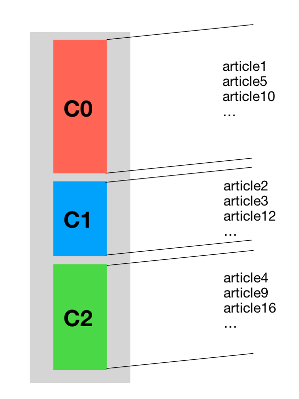
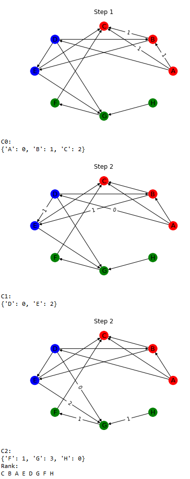

# Wikipedia-Hyperlink-Graph

In this project we perform an analysis of the Wikipedia Hyperlink graph. In particular, given extra information about the categories to which an article belongs to, we are curious to rank the articles according to some criteria. 

For this purpose we use the Wikipedia graph released by the SNAP group.

***

## Research questions

**[RQ1]** Build the graph , where *V* is the set of articles and *E* the hyperlinks among them, and provide its basic information:
 
- If it is direct or not
- The number of nodes
- The number of edges 
- The average node degree. Is the graph dense?

**[RQ2]** Given a category  as input we want to rank all of the nodes in *V* according to the following criteria:
	
* Obtain a *block-ranking*, where the blocks are represented by the categories. In particular, we want:

	
Each category  corresponds to a list of nodes. 

The first category of the rank, , always corresponds to the input category. The order of the remaining categories is given by:

The lower is the distance from , the higher is the  position in the rank.  is the set of all the possible shortest paths between the nodes of   and . Moreover, the length of a path is given by the sum of the weights of the edges it is composed by.

* Once you obtain the  vector, you want to sort the nodes in each category. The way you should sort them is explained by this example:

	*	Suppose the categories order, given from the previous point, is 

__[STEP1]__ Compute subgraph induced by . For each node compute the sum of the weigths of the in-edges.

 

__[STEP2]__ Extend the graph to the nodes that belong to . Thus, for each article in  compute the score as before. __Note__ that the in-edges coming from the previous category, , have as weights the score of the node that sends the edge.

__[STEP3]__ Repeat Step2 up to the last category of the ranking. In the last step of the example you clearly see the weight update of the edge coming from node *E*.
	

